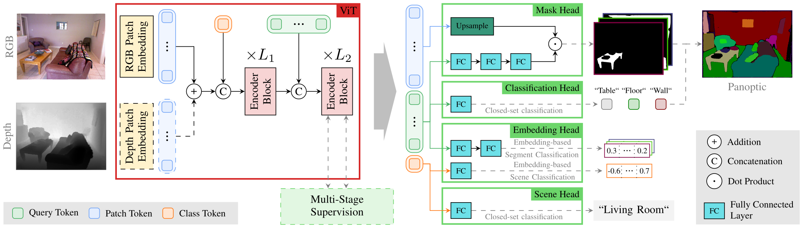
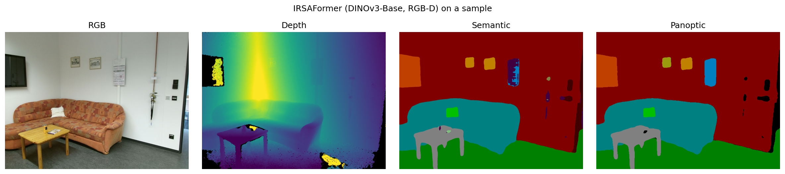

# IRSAFormer: Efficient Indoor Robotic Scene Analysis with Encoder-Centric Vision Transformers
This repository contains the code for our paper
"Efficient Indoor Robotic Scene Analysis with Encoder-Centric Vision Transformers"
(Accepted at IJCNN 2026)

IRSAFormer adapts the [EoMT](https://arxiv.org/abs/2503.19108) paradigm to indoor robotic
scene analysis. A small set of query tokens is injected into a largely unmodified
[DINOv3](https://arxiv.org/abs/2508.10104) Vision Transformer backbone,
and lightweight task heads on top jointly predict scene classification, semantic
segmentation, panoptic segmentation, and optional distilled text-aligned visual
embeddings. Depth can additionally be incorporated as a second input modality.

IRSAFormer continues our line of work on efficient indoor RGB-D scene analysis, building
on [EMSANet](https://github.com/TUI-NICR/EMSANet),
[EMSAFormer](https://github.com/TUI-NICR/EMSAFormer), and
[DVEFormer](https://github.com/TUI-NICR/DVEFormer).

The token-based pipeline (decoders, postprocessing, task helpers) lives in the
companion package [nicr-multitask-scene-analysis](https://github.com/TUI-NICR/nicr-multitask-scene-analysis)
(submodule under `lib/`). Datasets are handled through
[nicr-scene-analysis-datasets](https://github.com/TUI-NICR/nicr-scene-analysis-datasets).



The repository includes code for training, evaluating, and applying our 
network. We also provide code for exporting the model to the ONNX format
as well as measuring the inference time with TensorRT.

## License and Citations
The source code is published under Apache 2.0 license, see
[license file](LICENSE) for details.

If you use the source code or the network weights, please cite the following paper:

> Fischedick, S., Stephan, B., Seichter, D., Gross, H.-M.
*Efficient Indoor Robotic Scene Analysis with Encoder-Centric Vision Transformers*,
in IEEE International Joint Conference on Neural Networks (IJCNN), 2026.

<details>
<summary>BibTeX</summary>

```bibtex
@inproceedings{irsaformer2026ijcnn,
  title     = {{Efficient Indoor Robotic Scene Analysis with Encoder-Centric Vision Transformers}},
  author    = {Fischedick, S{\"o}hnke Benedikt and Stephan, Benedict and Seichter, Daniel and Gross, Horst-Michael},
  booktitle = {IEEE International Joint Conference on Neural Networks (IJCNN)},
  year      = {2026}
}
```
</details>

## Content
- [Installation](#installation): Set up the environment with `uv` (recommended) or `conda`.
- [Weights](#weights): Delta weights, archive format, and throughput.
- [Evaluation](#evaluation): Per-task checkpoints, downloads, and reproduction commands.
- [Inference](#inference): Run inference on a dataset, on individual samples, or
  measure throughput.
- [Training](#training): Train IRSAFormer from scratch.
- [Changelog](#changelog)

## Installation
IRSAFormer can be set up with either uv (recommended) or conda. 
We assume that the chosen tool is already installed.

### Option 1: uv (recommended)
1. Clone repository:
    ```bash
    # do not forget the '--recursive'
    git clone --recursive https://github.com/TUI-NICR/IRSAFormer

    # navigate to the cloned directory
    cd IRSAFormer
    ```

2. Install dependencies using uv:
    ```bash
    # sync all dependencies and create the virtual environment
    uv sync

    ```

3. Activate the virtual environment:
    ```bash
    source .venv/bin/activate
    ```

### Option 2: conda
```bash
    # do not forget the '--recursive'
    git clone --recursive https://github.com/TUI-NICR/IRSAFormer
    
    # navigate to the cloned directory
    cd IRSAFormer

    # create and activate conda environment
    conda env create -f irsaformer_environment.yml
    conda activate irsaformer

    # install editable workspace packages
    python -m pip install -e ./lib/nicr-scene-analysis-datasets
    python -m pip install -e ./lib/nicr-multitask-scene-analysis
    python -m pip install -e .
```

### Datasets
We trained and evaluated on
[NYUv2](https://cs.nyu.edu/~silberman/datasets/nyu_depth_v2.html),
[SUN RGB-D](https://rgbd.cs.princeton.edu/),
[ScanNet V2](http://www.scan-net.org/), and
[Hypersim](https://machinelearning.apple.com/research/hypersim).
Follow the instructions in `./lib/nicr-scene-analysis-datasets` (or
[HERE](https://github.com/TUI-NICR/nicr-scene-analysis-datasets)) to prepare them.
In the following, we assume that they are stored at `./datasets`.

## Weights
We provide trained checkpoints for the three DINOv3 backbone sizes (Small+, Base,
Large), each in an RGB and an RGB-D variant. All models were trained on the
mixed-dataset combination (NYUv2 + Hypersim + SUN RGB-D + ScanNet) and
evaluated on the three indoor RGB-D benchmarks.

On an NVIDIA Jetson AGX Orin (TensorRT, FP16), IRSAFormer reaches the
following throughput:

| Backbone      | RGB FPS | RGB-D FPS |
|---------------|:-------:|:---------:|
| DINOv3-Small+ | 51.36   | 50.98     |
| DINOv3-Base   | 26.88   | 26.83     |
| DINOv3-Large  | 14.17   | 14.19     |

> [!IMPORTANT]
> The provided model weights are **deltas** with respect to the DINOv3 weights.
> The loader fetches the matching upstream backbone from `timm` automatically the
> first time you run inference (the public `timm/vit_*_dinov3_qkvb.lvd1689m`
> weights), so only an internet connection is needed for that first download. The
> delta weights are derived from DINOv3 and therefore inherit the
> [DINOv3 License](https://github.com/facebookresearch/dinov3/blob/main/LICENSE.md).

Each checkpoint archive is a `.tar.gz` that expands to
`irsaformer_<task>_<backbone>_<modality>/`, containing the delta weights
(`*.pth`) and the exact model/task flags the checkpoint was trained with
(`model_args.txt`). Extract it with `tar -xzf <archive> -C trained_models`. 
See [Evaluation](#evaluation) and [Inference](#inference) for how to use it.

## Evaluation

Each task is a separate checkpoint, validated with `main.py --validation-only`. The
examples use the DINOv3-Base RGB-D checkpoints, each on a different dataset so they
cover the per-dataset flags (split, class count). The DINOv3-Base RGB-D architecture
is the default, so the commands only set what differs from it. All reproduce the
paper table setup.

Due to refactoring-induced numerical changes and minor bug fixes, metrics
reproduced with the current code may slightly differ from the reported values.

### Semantic Segmentation

| Backbone        | Modality | NYUv2 mIoU | SUN RGB-D mIoU | ScanNet mIoU | Download         |
|-----------------|:--------:|:----------:|:--------------:|:------------:|:----------------:|
| DINOv3-Small+   | RGB      | 58.26      | 54.12          | 62.51        | [Download](https://drive.usercontent.google.com/download?id=1LoOrWvSyjTosWFlZPyGdd7xrw143hr7q) |
| DINOv3-Small+   | RGB-D    | 57.93      | 52.34          | 65.96        | [Download](https://drive.usercontent.google.com/download?id=17aCyyYAh7lnnCnz-ukEdYfQUI2siwdU1) |
| DINOv3-Base     | RGB      | 63.20      | 56.20          | 68.40        | [Download](https://drive.usercontent.google.com/download?id=1jFjSfq66B7Dw6g-iPsl0NgKkLc6v3KbD) |
| DINOv3-Base     | RGB-D    | 62.67      | 56.30          | 68.99        | [Download](https://drive.usercontent.google.com/download?id=1mO6Wz5ekX8juDorX-R-deJ7lb5J4zib2) |
| DINOv3-Large    | RGB      | 67.16      | 57.69          | 72.72        | [Download](https://drive.usercontent.google.com/download?id=16QFezke3fJqMFDJuwyJXZ5-Mifb4IFkR) |
| DINOv3-Large    | RGB-D    | 67.62      | 57.63          | 70.62        | [Download](https://drive.usercontent.google.com/download?id=1eh3NKDO9hF53H0Z5oqV5Ew3Kui2zZy7t) |

Download the checkpoints:
```bash
gdown 1LoOrWvSyjTosWFlZPyGdd7xrw143hr7q -O trained_models/irsaformer_semantic_small_plus_rgb.tar.gz
gdown 17aCyyYAh7lnnCnz-ukEdYfQUI2siwdU1 -O trained_models/irsaformer_semantic_small_plus_rgbd.tar.gz
gdown 1jFjSfq66B7Dw6g-iPsl0NgKkLc6v3KbD -O trained_models/irsaformer_semantic_base_rgb.tar.gz
gdown 1mO6Wz5ekX8juDorX-R-deJ7lb5J4zib2 -O trained_models/irsaformer_semantic_base_rgbd.tar.gz
gdown 16QFezke3fJqMFDJuwyJXZ5-Mifb4IFkR -O trained_models/irsaformer_semantic_large_rgb.tar.gz
gdown 1eh3NKDO9hF53H0Z5oqV5Ew3Kui2zZy7t -O trained_models/irsaformer_semantic_large_rgbd.tar.gz
find ./trained_models -name "irsaformer_*.tar.gz" -exec tar -xzf {} -C ./trained_models \;
```

Trained for `token-mask + token-semantic` and selected by best validation mIoU.
Reproduce (DINOv3-Base RGB-D, NYUv2, test split, 40 classes):
```bash
python main.py \
    --dataset nyuv2 \
    --dataset-path ./datasets/nyuv2 \
    --validation-split test \
    --raw-depth \
    --tasks token-mask token-semantic \
    --weights-filepath ./trained_models/irsaformer_semantic_base_rgbd/irsaformer_semantic_base_rgbd.pth \
    --token-num-queries 64 \
    --validation-only \
    --skip-sanity-check \
    --wandb-mode disabled
```
```text
Validation results:
{ 
    ...
    'valid_token_semantic_miou': 0.6267,
    ... 
}
```

### Panoptic Segmentation

| Backbone        | Modality | NYUv2 PQ | SUN RGB-D PQ | ScanNet PQ | Download         |
|-----------------|:--------:|:--------:|:------------:|:----------:|:----------------:|
| DINOv3-Small+   | RGB      | 47.86    | 52.40        | 52.53      | [Download](https://drive.usercontent.google.com/download?id=1XnXzF9_nhFPfornSTu2YxjXgX2sCP19t) |
| DINOv3-Small+   | RGB-D    | 48.23    | 53.47        | 54.52      | [Download](https://drive.usercontent.google.com/download?id=1BbHv35DxzeuenGz8jo3XIy_fn07X_B3p) |
| DINOv3-Base     | RGB      | 49.90    | 55.97        | 55.01      | [Download](https://drive.usercontent.google.com/download?id=1dXJNmuDwz_98LiLHHqlSclRQ5kLGLvEg) |
| DINOv3-Base     | RGB-D    | 50.59    | 52.11        | 54.82      | [Download](https://drive.usercontent.google.com/download?id=1UyJA2wKvKLXRz-hKsNDCtO-6dWbgcF-Y) |
| DINOv3-Large    | RGB      | 54.56    | 59.58        | 60.84      | [Download](https://drive.usercontent.google.com/download?id=1gEAPZiEhljQpEeOusSCgLLAxCV8ykWmP) |
| DINOv3-Large    | RGB-D    | 56.14    | 58.56        | 58.83      | [Download](https://drive.usercontent.google.com/download?id=1gzvsONvsoYXZbInjKbiwtF7jvpc4odbw) |

Download the checkpoints:
```bash
gdown 1XnXzF9_nhFPfornSTu2YxjXgX2sCP19t -O trained_models/irsaformer_panoptic_small_plus_rgb.tar.gz
gdown 1BbHv35DxzeuenGz8jo3XIy_fn07X_B3p -O trained_models/irsaformer_panoptic_small_plus_rgbd.tar.gz
gdown 1dXJNmuDwz_98LiLHHqlSclRQ5kLGLvEg -O trained_models/irsaformer_panoptic_base_rgb.tar.gz
gdown 1UyJA2wKvKLXRz-hKsNDCtO-6dWbgcF-Y -O trained_models/irsaformer_panoptic_base_rgbd.tar.gz
gdown 1gEAPZiEhljQpEeOusSCgLLAxCV8ykWmP -O trained_models/irsaformer_panoptic_large_rgb.tar.gz
gdown 1gzvsONvsoYXZbInjKbiwtF7jvpc4odbw -O trained_models/irsaformer_panoptic_large_rgbd.tar.gz
find ./trained_models -name "irsaformer_*.tar.gz" -exec tar -xzf {} -C ./trained_models \;
```

Trained for `token-mask + token-panoptic` and selected by best validation PQ.
Reproduce (DINOv3-Base RGB-D, ScanNet, valid split, 20 classes):
ScanNet uses the 20-class protocol and the `valid` split (the official test split
requires submission to the ScanNet benchmark server):
```bash
python main.py \
    --dataset scannet \
    --dataset-path ./datasets/scannet \
    --validation-split valid \
    --scannet-semantic-n-classes 20 \
    --raw-depth \
    --tasks token-mask token-panoptic \
    --weights-filepath ./trained_models/irsaformer_panoptic_base_rgbd/irsaformer_panoptic_base_rgbd.pth \
    --validation-only \
    --skip-sanity-check \
    --wandb-mode disabled
```
```text
Validation results:
{ 
    ...
    'valid_token_panoptic_all_with_gt_token_pq': 0.5462,
    ... 
}
```

### Scene Classification

| Backbone        | Modality | NYUv2 bAcc | SUN RGB-D bAcc | ScanNet bAcc | Download         |
|-----------------|:--------:|:----------:|:--------------:|:------------:|:----------------:|
| DINOv3-Small+   | RGB      | 80.61      | 65.65          | 48.00        | [Download](https://drive.usercontent.google.com/download?id=1Mm_22lriz5Flwc7RgkSKOgElDR-JpS_s) |
| DINOv3-Small+   | RGB-D    | 79.73      | 66.04          | 51.37        | [Download](https://drive.usercontent.google.com/download?id=1FiKmAIT8aN2BCDtgSnOIFIuqP6rXHbJT) |
| DINOv3-Base     | RGB      | 82.21      | 68.46          | 53.37        | [Download](https://drive.usercontent.google.com/download?id=1nZZCsefkjz0-nlOPOg1IUiverFbzut-0) |
| DINOv3-Base     | RGB-D    | 80.94      | 65.93          | 52.62        | [Download](https://drive.usercontent.google.com/download?id=1d_WCd8p4ZTltQ8o1n9-s7yWo_dyG-HU-) |
| DINOv3-Large    | RGB      | 85.43      | 70.97          | 56.74        | [Download](https://drive.usercontent.google.com/download?id=12CUjt0VD3B6SYmpsWQM9sxMMazoqVakj) |
| DINOv3-Large    | RGB-D    | 83.56      | 70.88          | 56.80        | [Download](https://drive.usercontent.google.com/download?id=1IQxWezy9otnadOwMmTjWtP1QrJmeQFQn) |

Download the checkpoints:
```bash
gdown 1Mm_22lriz5Flwc7RgkSKOgElDR-JpS_s -O trained_models/irsaformer_scene_small_plus_rgb.tar.gz
gdown 1FiKmAIT8aN2BCDtgSnOIFIuqP6rXHbJT -O trained_models/irsaformer_scene_small_plus_rgbd.tar.gz
gdown 1nZZCsefkjz0-nlOPOg1IUiverFbzut-0 -O trained_models/irsaformer_scene_base_rgb.tar.gz
gdown 1d_WCd8p4ZTltQ8o1n9-s7yWo_dyG-HU- -O trained_models/irsaformer_scene_base_rgbd.tar.gz
gdown 12CUjt0VD3B6SYmpsWQM9sxMMazoqVakj -O trained_models/irsaformer_scene_large_rgb.tar.gz
gdown 1IQxWezy9otnadOwMmTjWtP1QrJmeQFQn -O trained_models/irsaformer_scene_large_rgbd.tar.gz
find ./trained_models -name "irsaformer_*.tar.gz" -exec tar -xzf {} -C ./trained_models \;
```

Trained for `token-scene` and selected by best validation balanced accuracy.
Reproduce (DINOv3-Base RGB-D, SUN RGB-D, test split):
Scene classification reads the globally pooled backbone features and never uses the
query tokens, so these checkpoints do not need query tokens (`--token-num-queries 0`):
```bash
python main.py \
    --dataset sunrgbd \
    --dataset-path ./datasets/sunrgbd \
    --validation-split test \
    --tasks token-scene \
    --weights-filepath ./trained_models/irsaformer_scene_base_rgbd/irsaformer_scene_base_rgbd.pth \
    --token-num-queries 0 \
    --token-attention-mask-mode none \
    --validation-only \
    --skip-sanity-check \
    --wandb-mode disabled
```
```text
Validation results:
{ 
    ...
    'valid_scene_bacc': 0.6627,
    ... 
}
```

### Token-level Embeddings

Separate training adding distilled visual embedding heads
([Alpha-CLIP](https://github.com/SunzeY/AlphaCLIP) teacher) for text-aligned
segmentation and scene classification beyond the closed-set predictions above,
following [DVEFormer](https://github.com/TUI-NICR/DVEFormer).

The visual-embedding checkpoint
([Download](https://drive.usercontent.google.com/download?id=1Ly7srBiMd9bdQtv3J_QPUhuMzpacg6b3))
provides the text-aligned segmentation metrics (mIoU / PQ):

| Dataset  | mIoU (text / visual / linear-probe) | PQ (text / visual / linear-probe) |
|----------|:-----------------------------------:|:---------------------------------:|
| NYUv2    | 41.06 / 49.20 / 60.93              | 36.83 / 42.31 / 49.26            |
| SUN RGB-D| 38.71 / 39.63 / 46.70              | 35.42 / 37.76 / 45.79            |
| ScanNet  | 46.85 / 53.99 / 66.61              | 37.77 / 43.37 / 49.11            |

The scene-embedding checkpoint
([Download](https://drive.usercontent.google.com/download?id=1hxMIlrgc6u-Gzko6R_qfuQxAzYkWh2da))
provides the scene-classification accuracy (bAcc):

| Dataset  | bAcc (text / visual / linear-probe) |
|----------|:-----:|
| NYUv2    | 72.40 / 82.03 / 84.57 |
| SUN RGB-D| 60.45 / 65.49 / 69.98 |
| ScanNet  | 50.41 / 54.63 / 55.03 |

Download the checkpoints:
```bash
gdown 1Ly7srBiMd9bdQtv3J_QPUhuMzpacg6b3 -O trained_models/irsaformer_embedding_base_rgbd.tar.gz
gdown 1hxMIlrgc6u-Gzko6R_qfuQxAzYkWh2da -O trained_models/irsaformer_scene_embedding_base_rgbd.tar.gz
find ./trained_models -name "irsaformer_*.tar.gz" -exec tar -xzf {} -C ./trained_models \;
```

Reproduce (DINOv3-Base RGB-D, NYUv2, test split):
The embedding model's heads are per-dataset, so `--dataset` must be one it 
was trained on (nyuv2, sunrgbd, scannet).

Visual embedding (text-aligned segmentation):
```bash
python main.py \
    --dataset nyuv2 \
    --dataset-path ./datasets/nyuv2 \
    --validation-split test \
    --raw-depth \
    --tasks token-mask token-visual-embedding \
    --weights-filepath ./trained_models/irsaformer_embedding_base_rgbd/irsaformer_embedding_base_rgbd.pth \
    --validation-only \
    --skip-sanity-check \
    --wandb-mode disabled
```
```text
Validation results:
{ 
    ...
    'valid_token_visual_embedding_text_based_miou': 0.4106,
    'valid_token_visual_embedding_visual_mean_based_miou': 0.4920,
    'valid_token_visual_embedding_linear_probing_miou': 0.6093,
    'valid_token_visual_embedding_text_based_all_token_pq': 0.3683,
    'valid_token_visual_embedding_visual_mean_based_all_token_pq': 0.4231,
    'valid_token_visual_embedding_linear_probing_all_token_pq': 0.4926,
    ... 
}
```

Scene embedding (text-aligned scene classification):
```bash
python main.py \
    --dataset nyuv2 \
    --dataset-path ./datasets/nyuv2 \
    --validation-split test \
    --raw-depth \
    --tasks token-image-embedding \
    --weights-filepath ./trained_models/irsaformer_scene_embedding_base_rgbd/irsaformer_scene_embedding_base_rgbd.pth \
    --token-num-queries 0 \
    --token-attention-mask-mode none \
    --validation-only \
    --skip-sanity-check \
    --wandb-mode disabled
```
```text
Validation results:
{ 
    ...
    'valid_token_image_embedding_text_based_bacc': 0.7240,
    'valid_token_image_embedding_visual_mean_based_bacc': 0.8203,
    'valid_token_image_embedding_linear_probing_bacc': 0.8457,
    ... 
}
```

### Other backbones and modalities
The examples above use the DINOv3-Base RGB-D defaults. Any other checkpoint 
contains its full parameters in its `model_args.txt`, so source that 
with `$(cat ...)` and just add the dataset:
```bash
python main.py \
    --validation-only \
    $(cat ./trained_models/irsaformer_panoptic_large_rgbd/model_args.txt) \
    --weights-filepath ./trained_models/irsaformer_panoptic_large_rgbd/irsaformer_panoptic_large_rgbd.pth \
    --dataset nyuv2 \
    --dataset-path ./datasets/nyuv2 \
    --validation-split test \
    --skip-sanity-check \
    --wandb-mode disabled
```
NYUv2 and SUN RGB-D use `--validation-split test` (`--dataset sunrgbd
--dataset-path ./datasets/sunrgbd` for SUN RGB-D). For ScanNet, use
`--validation-split valid` and add `--scannet-semantic-n-classes 20`.

## Inference

### Dataset Inference
Add `--visualize-validation` to an evaluation command to write the predictions as
images per sample (to `--visualization-output-path`, or a default path derived from
the weights):
```bash
python main.py \
    $(cat ./trained_models/irsaformer_panoptic_base_rgbd/model_args.txt) \
    --weights-filepath ./trained_models/irsaformer_panoptic_base_rgbd/irsaformer_panoptic_base_rgbd.pth \
    --dataset nyuv2 \
    --dataset-path ./datasets/nyuv2 \
    --validation-split test \
    --validation-only \
    --visualize-validation \
    --skip-sanity-check \
    --wandb-mode disabled
```
The same setup applies to SUN RGB-D and ScanNet by adjusting `--dataset`,
`--dataset-path`, and the checkpoint file.
`inference_dataset.py` is a separate tool that exports per-sample predictions in the official ScanNet evaluation format (for benchmark submission).

### Sample Inference
`inference_samples.py` applies a trained model to the example images in `./samples`
and shows the predictions in a window (`--show-results`):
```bash
python inference_samples.py \
    $(cat ./trained_models/irsaformer_panoptic_base_rgbd/model_args.txt) \
    --weights-filepath ./trained_models/irsaformer_panoptic_base_rgbd/irsaformer_panoptic_base_rgbd.pth \
    --dataset nyuv2 \
    --tasks token-mask token-panoptic \
    --raw-depth \
    --samples-path ./samples \
    --show-results

# Regenerate samples/results/sample.png (the panel figure above) with --panel-output.
# Uses the panoptic checkpoint; thresholds are visually tuned for this sample.
# python inference_samples.py \
#    $(cat ./trained_models/irsaformer_panoptic_base_rgbd/model_args.txt) \
#    --weights-filepath ./trained_models/irsaformer_panoptic_base_rgbd/irsaformer_panoptic_base_rgbd.pth \
#    --dataset nyuv2 --dataset-path ./datasets/nyuv2 --samples-path ./samples \
#    --model-label "DINOv3-Base, RGB-D" \
#    --panel-output ./samples/results/sample.png
```

Example predictions on a sample image (not from any training dataset), using the
DINOv3-Base RGB-D panoptic checkpoint. From left to right: RGB input, depth,
predicted semantic segmentation, and panoptic segmentation (the panoptic head
provides both).




### Time Inference
We timed the inference on an NVIDIA Jetson AGX Orin with Jetpack 6.2 (TensorRT 10.3,
PyTorch 2.7.0/torchvision 0.22.0).

Reproducing the timings on an NVIDIA Jetson AGX Orin further requires:
- installing PyTorch and TorchVision via `pip3 install --index-url https://pypi.jetson-ai-lab.io/jp6/cu126 torch==2.7.0 torchvision==0.22.0`
- enabling MAXN power mode
- installation of IRSAFormer dependencies

Subsequently, you can run `./inference_time.bash` (set `DATASET_PATH` if you want to use real samples) to reproduce the reported timings.

## Training
Use `main.py` to train IRSAFormer on various dataset combinations or any other
dataset that you implemented following the implementation of the provided datasets.
Evaluating every dataset during training adds significant overhead, so we only
enable evaluation on NYUv2 while training the model.

Each released checkpoint is its own single-task run on the mixed dataset combination
(matches the paper recipe). Example: Train the DINOv3-Base RGB-D panoptic checkpoint:

```bash
python main.py \
    --tasks token-mask token-panoptic \
    --dataset nyuv2:hypersim:sunrgbd:scannet \
    --dataset-path ./datasets/nyuv2:./datasets/hypersim:./datasets/sunrgbd:./datasets/scannet \
    --split train:train:train:train \
    --validation-split test:none:none:none \
    --subset-train 1.0:0.1:1.0:0.25 \
    --input-modalities rgbd \
    --token-modality rgbd \
    --rgbd-encoder-backbone dinov3_base_qkvb \
    --learning-rate 1.5e-4 \
    --n-epochs 25 \
    --raw-depth \
    --results-basepath ./results
```

The other checkpoints are trained the same way, each as its own run with a different
`--tasks` (not a joint model):
- Semantic: `--tasks token-mask token-semantic`
- Scene: `--tasks token-scene --token-num-queries 0 --token-attention-mask-mode none`
- Visual embedding (text-aligned segmentation, [Alpha-CLIP](https://github.com/SunzeY/AlphaCLIP)
  distillation): `--tasks token-mask token-visual-embedding`
- Scene embedding (text-aligned scene classification): `--tasks token-image-embedding --token-num-queries 0 --token-attention-mask-mode none`

Dataset concatenation is achieved using `:` as the delimiter.
The `--subset-train` parameter controls the fraction of each dataset sampled per
epoch. For example, setting hypersim to 0.1 draws roughly 10% of its samples each
epoch, with the subset potentially changing between epochs.
For more options, we refer to `./irsaformer/args.py` or simply run:
```bash
python main.py --help
```

## Changelog

**Version 0.1.0 (June 21, 2026)**
- initial release of IRSAFormer: Efficient Indoor Robotic Scene Analysis with
  Encoder-Centric Vision Transformers

